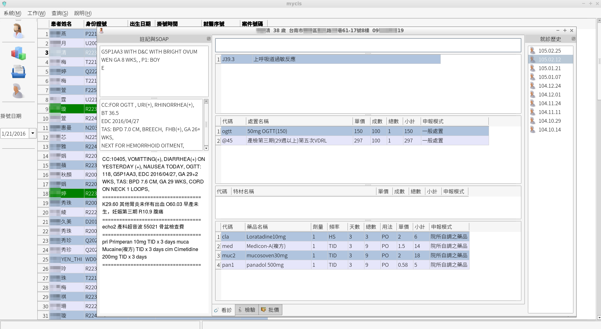
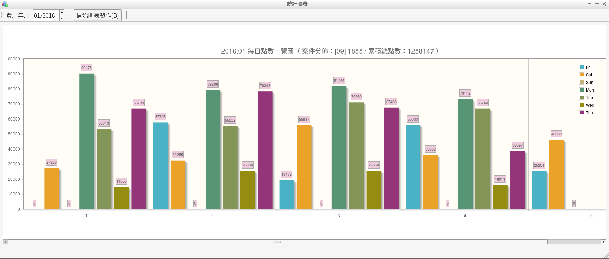
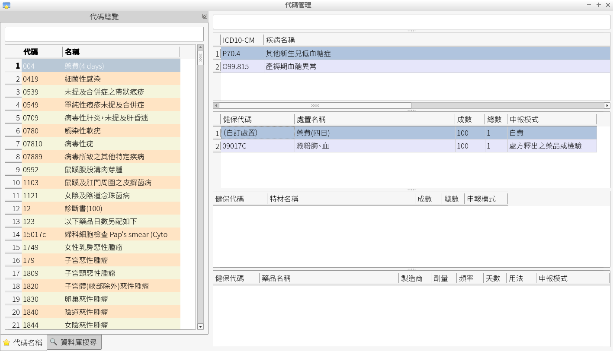
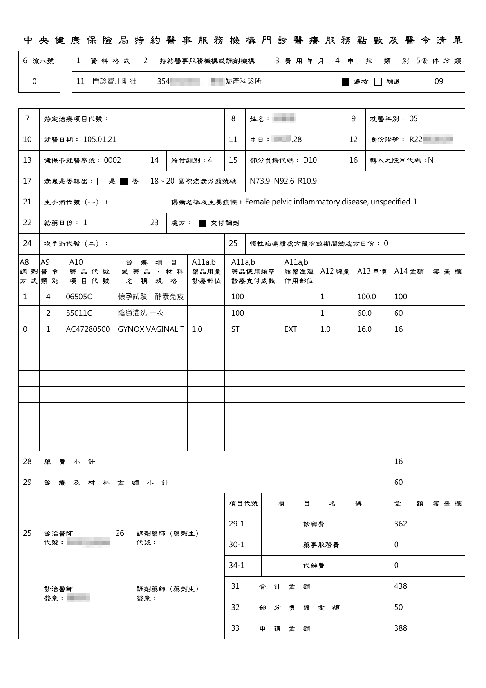

MYCIS 
=====
健保西醫診所資訊系統（MY Clinical Information System），以 Python 開發。

## 目錄
* [緣起](#緣起)
* [主要功能與特點](#主要功能與特點)
* [螢幕截圖](#螢幕截圖)
* [使用技術](#使用技術)
* [安裝](#安裝)
* [TODO](#TODO)

## 緣起
台灣於 2004 年起正式使用健保 IC 卡，基層醫療院所的資訊電子化邁入新階段。然坊間商業化健保西醫診所資訊系統多沿用 90 年代 dBase 應用程式（[參見討論](https://ithelp.ithome.com.tw/questions/10178931)），資料正確性、效能與性價比並不理想。有鑑於此，決心發展簡單可靠、現代化與高度自動化的資訊系統。

本系統原始 VB6 初版於 2005 年開始上線使用，至 2011 年後以 Python 改寫。基於過去成功使用經驗與未來需求，於 2016 年起設計改版，2021 年重新開源。

## 主要功能與特點
* 執行西醫診所日常業務：IC卡掛號寫入與查詢、看診資料輸入、列印處方籤 / 檢驗單 / 收據 / 診斷證明、看診資料上傳、申報與審查資料製作。
* 簡化健保西醫診所業務流程；自動排程健保藥品與處置資料更新、每日看診資料上傳與資料庫備份。

## 螢幕截圖 
<p align="center">
  主視窗與看診視窗。<br/><br/>
  <kbd><kbd> 
</p>

<p align="center">
  指定月份每日申報點數計算。<br/><br/>
  <kbd></kbd>
</p>

<p align="center">
  代碼指定視窗。<br/><br/>
  <kbd></kbd>
</p>

<p align="center">
  總表 pdf 製作結果。<br/><br/>
  <kbd></kbd>
</p>

## 使用技術
* 作業系統環境：Windows（健保署讀卡機控制軟體[只有 Windows 版]( https://www.nhi.gov.tw/Content_List.aspx?n=B47A98062A3FE158&topn=5FE8C9FEAE863B46 )）
* 程式語言：Python 2.7
* 使用者界面函數庫：[PyQt4]( https://riverbankcomputing.com/software/pyqt/ ) 
* 資料庫：[SQLite]( https://www.sqlite.org/index.html )  
* PDF 函數庫：[ReportLab]( https://www.reportlab.com/opensource/ ) 
* 索引與搜尋函數庫：[Whoosh]( https://whoosh.readthedocs.io/en/latest/intro.html )
* 資料備份與壓縮工具：[rsync]( https://rsync.samba.org/ )、[7z]( https://www.7-zip.org/ )、[xdelta]( https://github.com/jmacd/xdelta ) 

## 安裝 
- 下載並安裝 [ActivePython-2.7]( https://platform.activestate.com/ActiveState/ActivePython-2.7/auto-fork?content=dl_activepython_win&download=windows&_ga=2.36777632.186724723.1618937110-908439258.1618937109 ) 。
- 下載並安裝 [PyQt4]( https://www.riverbankcomputing.com/static/Downloads/PyQt4/4.12.3/PyQt4_gpl_win-4.12.3.zip )。
- 於命令列執行 
```shell
pip install reportlab beautifulsoup4 Whoosh
```

## TODO
短期目標：
* 新掛號視窗
* 新 IC 卡查詢視窗
* 檢驗釋出結果視窗
* 多機版： 使用 PostgreSQL 資料庫
* 功能完整測試

中長期目標：
* 升級至 Python 3 / PyQt6
* 網路預約系統
* FHIR 電子病歷系統
